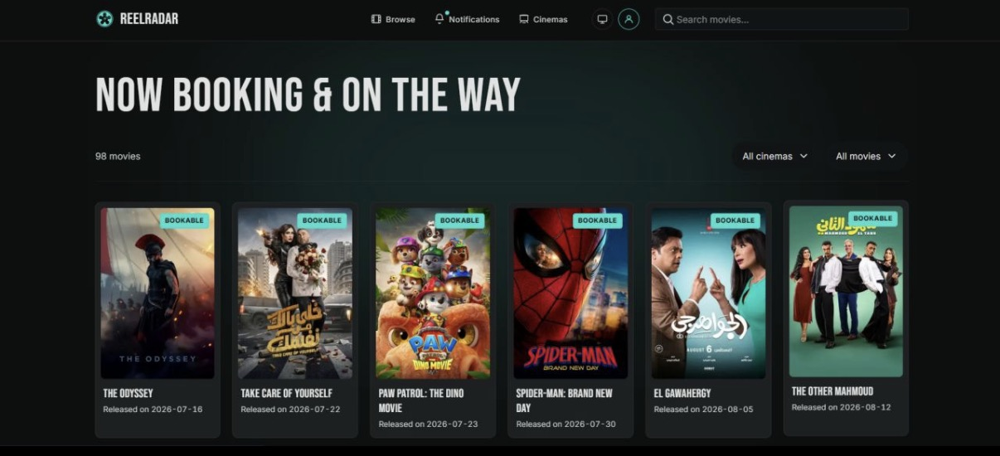
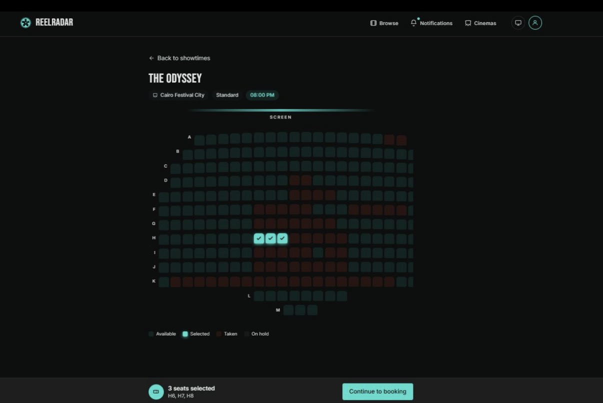
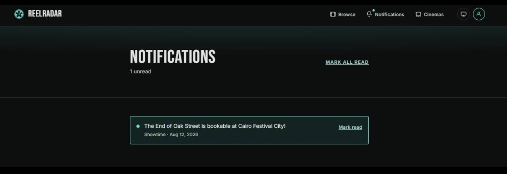

<a id="readme-top"></a>

<!-- PROJECT SHIELDS -->
<div align="center">

[![CI][ci-shield]][ci-url]
[![Contributors][contributors-shield]][contributors-url]
[![Forks][forks-shield]][forks-url]
[![Stargazers][stars-shield]][stars-url]
[![Issues][issues-shield]][issues-url]
[![MIT License][license-shield]][license-url]
[![LinkedIn][linkedin-shield]][linkedin-url]

</div>

<!-- PROJECT LOGO -->
<br />
<div align="center">
  <a href="https://github.com/belalanaskoura/reel-radar">
    
  </a>

  <h3 align="center">ReelRadar</h3>

  <p align="center">
    Never miss the moment a movie goes on sale at your cinema again.
    <br />
    <a href="https://reelradar.online"><strong>View Live Demo »</strong></a>
    <br />
    <br />
    <a href="https://github.com/belalanaskoura/reel-radar/issues/new?labels=bug&template=bug-report---.md">Report Bug</a>
    &middot;
    <a href="https://github.com/belalanaskoura/reel-radar/issues/new?labels=enhancement&template=feature-request---.md">Request Feature</a>
  </p>
</div>

<!-- TABLE OF CONTENTS -->
<details>
  <summary>Table of Contents</summary>
  <ol>
    <li>
      <a href="#about-the-project">About The Project</a>
      <ul>
        <li><a href="#why-this-exists">Why This Exists</a></li>
        <li><a href="#built-with">Built With</a></li>
      </ul>
    </li>
    <li>
      <a href="#how-it-works">How It Works</a>
    </li>
    <li>
      <a href="#getting-started">Getting Started</a>
      <ul>
        <li><a href="#prerequisites">Prerequisites</a></li>
        <li><a href="#installation">Installation</a></li>
        <li><a href="#environment-variables">Environment Variables</a></li>
      </ul>
    </li>
    <li>
      <a href="#usage">Usage</a>
      <ul>
        <li><a href="#scheduled-jobs">Scheduled Jobs</a></li>
        <li><a href="#one-off-scripts">One-off Scripts</a></li>
      </ul>
    </li>
    <li><a href="#roadmap">Roadmap</a></li>
    <li><a href="#contributing">Contributing</a></li>
    <li><a href="#license">License</a></li>
    <li><a href="#contact">Contact</a></li>
    <li><a href="#acknowledgments">Acknowledgments</a></li>
  </ol>
</details>

<!-- ABOUT THE PROJECT -->
## About The Project

ReelRadar is a watchlist app for Egypt cinemas: browse everything bookable
now or coming soon across **Scene Cinemas** (Cairo Festival City, District 5)
and **VOX Cinemas** (Mall of Egypt, City Center Alexandria, City Centre
Almaza), watchlist a title before it's even listed, and get notified the
moment tickets go on sale — by email and/or browser push — with a link
straight to booking. Prefer to track a whole cinema instead of a
specific movie? Get notified whenever a movie joins or leaves a
branch's lineup.

**Live at:** [reelradar.online](https://reelradar.online)

<!-- SCREENSHOTS -->
<p align="center">
  
</p>

<p align="right">(<a href="#readme-top">back to top</a>)</p>

### Why This Exists

Cinemas don't notify you when booking opens for a movie you're waiting on.
You either check back manually every day or find out too late that your
preferred showtime and format are already sold out. ReelRadar polls on
your behalf and notifies you the instant a watchlisted title becomes
bookable, so you stop manually refreshing their site.

It started as a personal script that checked one cinema branch for one
movie; this is the general version — anyone can watchlist any upcoming
title across any supported branch and get notified the moment it opens.

<p align="right">(<a href="#readme-top">back to top</a>)</p>

### Built With

* [![Next.js][Next.js]][Next-url]
* [![React][React.js]][React-url]
* [![TypeScript][TypeScript]][TypeScript-url]
* [![Tailwind CSS][Tailwind]][Tailwind-url]
* [![Supabase][Supabase]][Supabase-url]
* [![Playwright][Playwright]][Playwright-url]

<p align="right">(<a href="#readme-top">back to top</a>)</p>

<!-- HOW IT WORKS -->
## How It Works

- **Movie catalog** comes from [TMDB](https://www.themoviedb.org/),
  filtered to titles a real Egypt-based distributor has actually
  released before (or that clear a popularity safety net) — see
  [`src/lib/matching/egypt-distributor-filter.ts`](src/lib/matching/egypt-distributor-filter.ts).
  Movies whose release date has long passed with no real listing
  anywhere are cleaned up automatically
  ([`src/lib/matching/remove-unreleasable.ts`](src/lib/matching/remove-unreleasable.ts)).
- **Release dates and posters** prefer [elCinema](https://elcinema.com)
  over TMDB when elCinema has a record of the movie — TMDB's own release
  date can land on an unrelated country's date when it has no Egypt
  entry. Each cinema's own site is a further poster fallback for movies
  neither TMDB nor elCinema has an image for.
- **Scene showtimes** are scraped directly from Scene's own site
  ([`src/lib/scene/fetcher.ts`](src/lib/scene/fetcher.ts)), grouped by
  format (Standard, Premiere, IMAX, etc.) per branch.
- **VOX showtimes** come from elCinema instead of VOX's own site, which
  sits behind bot protection that blocks direct scraping —
  [`src/lib/elcinema/vox-showtimes.ts`](src/lib/elcinema/vox-showtimes.ts)
  pulls real per-day format/time/price detail for all three VOX
  branches. Booking links point at VOX's real per-branch showtime pages,
  not just its homepage.
- **Ticket prices** are shown per format on the showtime picker and seat
  page. VOX prices come straight from elCinema (already scraped
  alongside showtimes). Scene doesn't expose price anywhere in its own
  scraped data — it only surfaces after a seat is locked into a live
  booking session — so Scene prices are admin-maintained templates
  (per branch and format) instead, spot-checked periodically against a
  real live read to catch drift; see
  [`src/lib/scene/price-template.ts`](src/lib/scene/price-template.ts).
- **Title matching** links each cinema's own listings to the right TMDB
  entry: English search first, Arabic fallback on zero results, then an
  elCinema/IMDb cross-reference as a last resort for titles neither TMDB
  search mode finds (elCinema's own transliteration is fuzzy-matched,
  then its IMDb id resolves the real TMDB entry). Disambiguation uses a
  confirmed Egypt theatrical release date when a title collides with
  another movie of the same name. Anything that still can't be resolved
  confidently is left `unmatched`/`ambiguous`, never auto-picked.
- **Polling scales with watchlist size, not user count** — the poll job
  only re-checks (movie, branch) pairs that at least one user is
  watching, so cost stays flat as the user base grows.
- **Notifications** go out over two independent channels: email (via
  [Resend](https://resend.com)) and browser push (Web Push API, opt-in,
  one subscription per device). Either channel failing doesn't block the
  other. A movie notifies once per bookable "episode" — if it goes
  not-bookable and later reopens, watchers are notified again.
- **Track a cinema** to get notified about the branch itself rather than
  one title — a movie joining or leaving that branch's lineup triggers
  its own notification, independent of the per-movie watchlist above and
  gated by its own opt-in toggle. Detecting a lineup change reuses the
  scrapers' existing new-listing and delisting signals, so no extra
  scraping is needed just for this.
- **In-app feedback** (`/feedback`) — saved to the database and emailed
  directly to the maintainer.
- **Sign-in** supports email/password and Google OAuth. New signups get a
  one-time welcome email (~15 minutes after signup, so its copy can
  correctly reflect whether they've already turned on push) with a short
  feature tour and, for anyone without push enabled yet, setup steps.
- **Admin dashboard** (`/admin`, allowlisted via `ADMIN_EMAILS`) surfaces
  cache staleness per cinema chain, a manual resolve UI for
  unmatched/ambiguous titles (search by TMDB or IMDb id), delivery stats
  across email/push, and an opt-in broadcast tool for messaging all or
  specific users. A scheduled data-quality digest
  (`POST /api/admin-digest`) flags missing posters, un-synopsized matches,
  and stuck backlog items proactively rather than requiring someone to
  check the dashboard.

<p align="right">(<a href="#readme-top">back to top</a>)</p>

<!-- GETTING STARTED -->
## Getting Started

To get a local copy up and running, follow these steps.

### Prerequisites

* Node.js and npm
  ```sh
  npm install npm@latest -g
  ```
* A [Supabase](https://supabase.com) project (Postgres + Auth)
* API keys for [TMDB](https://www.themoviedb.org/settings/api) and
  [Resend](https://resend.com/api-keys)

### Installation

1. Clone the repo
   ```sh
   git clone https://github.com/belalanaskoura/reel-radar.git
   ```
2. Install NPM packages
   ```sh
   npm install
   ```
3. Copy the env file and fill in real values (see
   [Environment Variables](#environment-variables))
   ```sh
   cp .env.example .env.local
   ```
4. Run the dev server
   ```sh
   npm run dev
   ```

The app expects a Supabase project with a matching schema. Schema changes
aren't tracked as migration files in this repo — they're applied directly
via Supabase's SQL Editor. If you're standing up a fresh project, you'll
need to create the core tables yourself: `movies`, `branches`,
`movie_branch_slugs`, `showtimes_cache`, `watchlist`, `cinema_follows`,
`notification_log`, `notification_deliveries`, `profiles`,
`push_subscriptions`, `feedback`, `egypt_releases`, `egypt_distributors`,
`scene_price_templates`, `analytics_events`, `welcome_email_log`.

### Environment Variables

| Variable | Used for |
|---|---|
| `NEXT_PUBLIC_SUPABASE_URL` | Supabase project URL (public) |
| `NEXT_PUBLIC_SUPABASE_ANON_KEY` | Supabase anon/publishable key (public, RLS-scoped) |
| `SUPABASE_SERVICE_ROLE_KEY` | Server-only, bypasses RLS — used by the scheduled jobs and sync scripts. Never expose to the client. |
| `TMDB_API_KEY` | [TMDB API](https://www.themoviedb.org/settings/api) key |
| `SYNC_SECRET` | Shared secret required (via `x-sync-secret` header) to call the scheduled job routes below |
| `RESEND_API_KEY` | [Resend API](https://resend.com/api-keys) key, used to send email notifications and feedback |
| `RESEND_FROM_EMAIL` | Verified sending address for Resend (needs a domain-verified sender in production — see Known limitations) |
| `FEEDBACK_TO_EMAIL` | Address that receives submissions from `/feedback` |
| `NEXT_PUBLIC_VAPID_PUBLIC_KEY` | VAPID public key (public), used by the browser to subscribe to push |
| `VAPID_PRIVATE_KEY` | VAPID private key, server-only — used to sign push messages. Generate a pair with `npx web-push generate-vapid-keys`. Never expose to the client. |
| `ADMIN_EMAILS` | Comma-separated allowlist of emails permitted to view `/admin` |

Google sign-in is configured entirely in the Supabase dashboard
(Authentication → Providers → Google) and the corresponding Google Cloud
OAuth client — no additional env vars in this repo.

<p align="right">(<a href="#readme-top">back to top</a>)</p>

<!-- USAGE EXAMPLES -->
## Usage

Sign up, browse what's bookable now or coming soon at a Scene or VOX
branch, and watchlist a title — you'll get an email and/or browser push
the moment it becomes bookable, with a link straight to the cinema's
booking page. Past alerts are kept on `/notifications-history`.

Browser push works out of the box on desktop and Android. On iOS,
Safari only allows push subscriptions from an installed
(Add to Home Screen) PWA, not a plain browser tab — the app detects this
and prompts accordingly instead of failing silently.

<p align="center">
  
  <br /><br />
  
</p>

### Scheduled Jobs

These are plain API routes, not Vercel Cron — Vercel's Hobby tier caps
cron at once/day with up to ±59 min jitter, too coarse for this app's
polling needs. Instead, each route is secret-header-protected and meant
to be called on a real interval by an external scheduler (e.g.
[cron-job.org](https://cron-job.org)):

| Route | Purpose | Suggested interval |
|---|---|---|
| `POST /api/sync-movies` | Pulls upcoming movies from TMDB into the catalog | Daily |
| `POST /api/scrape-scene?branch=<id>` | Scrapes a Scene branch's listings and bookability, notifying cinema-trackers of any movie newly added to that branch | Every 15–30 min per branch |
| `POST /api/scrape-scene-delist` | Clears bookability for Scene movies no longer listed at all, notifying cinema-trackers of the removal | Every 15–30 min |
| `POST /api/scrape-vox` | Scrapes VOX showtimes (via elCinema) for all 3 branches, including delisting movies whose run has ended and notifying cinema-trackers of both additions and removals | Daily (full-detail fetch, more expensive per run) |
| `POST /api/scrape-formats` | Records which showtime formats (Standard, IMAX, etc.) are available per Scene branch, for `/cinemas` | Every 30 min |
| `POST /api/match-movies` | Matches new listings to TMDB entries | After each scrape run |
| `POST /api/poll` | Checks bookability for watched (movie, branch) pairs and notifies | Every 15–30 min |
| `POST /api/admin-digest` | Emails/pushes a data-quality summary to admins (missing posters, stuck matches, price drift) | Daily |
| `POST /api/welcome-email` | Emails new signups a one-time welcome (feature pointers, plus push setup steps if they haven't turned it on yet) | Every 15–30 min |
| `POST /api/check-scene-prices?branch=<id>&format=<name>` | Spot-checks one Scene branch+format's admin-maintained price template against a real live read | Daily per branch+format combo |

Each requires an `x-sync-secret: <SYNC_SECRET>` header. Example:

```bash
curl -X POST https://reelradar.online/api/poll \
  -H "x-sync-secret: $SYNC_SECRET"
```

### One-off Scripts

Run locally with `npx tsx scripts/<name>.ts` — these are historical
backfills / corrections, not part of the regular scheduled-job loop:

- `backfill-egypt-releases.ts` — scrapes ~4 years of elCinema's Egypt box
  office history to build the distributor allowlist and release-date
  ground truth.
- `backfill-movie-release-dates.ts` — re-checks existing movies against
  elCinema and corrects release dates that predate the elCinema-preferred
  pipeline.
- `backfill-movie-posters.ts` / `backfill-movie-posters-scene.ts` — fills
  in missing posters from elCinema, then Scene Cinemas, for existing
  movies that have neither a TMDB nor (in the first script's case) an
  elCinema poster.
- `cleanup-distributor-filter.ts` — retroactively re-checks the catalog
  against a tightened distributor allowlist.

<p align="right">(<a href="#readme-top">back to top</a>)</p>

<!-- ROADMAP -->
## Roadmap

- [ ] Direct VOX scraping if a reliable way around its bot protection is
      found (currently substituted via elCinema — see below)
- [ ] Close the remaining Arabic-title matching gap where cinema and
      elCinema transliterations differ too much for a confident fuzzy
      match
- [ ] Softer handling for unmatched distributors (confidence label
      instead of outright exclusion)
- [ ] Resilience improvements for HTML-scraping breakage on selector
      changes

**Known limitations:**

- **VOX isn't scraped directly**: VOX's own site sits behind bot
  protection that blocks direct fetching and headless-browser scraping
  alike. Showtimes instead come from elCinema, which has real per-branch
  listings for all 3 VOX branches — a reliable substitute, not a
  workaround with reduced accuracy.
- **Arabic-title matching gap**: an elCinema/IMDb cross-reference closes
  most cases where TMDB's own English/Arabic search comes up empty, but
  a cinema's transliteration and elCinema's can still differ enough that
  the fuzzy match itself misses — title matching requires a confident
  match as a safety guard against wrong matches, so these can land as
  `unmatched` even when both sources have the movie.
- **Distributor allowlist is strict, not permissive**: a movie with no
  popularity signal and no matched distributor history is excluded from
  the catalog outright, not shown with a lower-confidence label. This
  trades some false negatives (a genuinely Egypt-bound release from a
  brand-new distributor) for a cleaner catalog.
- **Scraping is best-effort**: both elCinema and Scene Cinemas are
  scraped directly from their public HTML, not an official API. Markup
  changes on either site can break parsing until the relevant selector
  is updated.

See the [open issues](https://github.com/belalanaskoura/reel-radar/issues)
for a full list of proposed features (and known issues).

<p align="right">(<a href="#readme-top">back to top</a>)</p>

<!-- CONTRIBUTING -->
## Contributing

Contributions are what make the open source community such an amazing
place to learn, inspire, and create. Any contributions you make are
**greatly appreciated**.

If you have a suggestion that would make this better, please fork the
repo and create a pull request. You can also simply open an issue with
the tag "enhancement". Don't forget to give the project a star! Thanks
again!

1. Fork the Project
2. Create your Feature Branch (`git checkout -b feature/AmazingFeature`)
3. Commit your Changes (`git commit -m 'Add some AmazingFeature'`)
4. Push to the Branch (`git push origin feature/AmazingFeature`)
5. Open a Pull Request

<p align="right">(<a href="#readme-top">back to top</a>)</p>

<!-- LICENSE -->
## License

Distributed under the MIT License. See [`LICENSE`](LICENSE) for more
information.

<p align="right">(<a href="#readme-top">back to top</a>)</p>

<!-- CONTACT -->
## Contact

Belal Anas

- LinkedIn: [belal-anas](https://www.linkedin.com/in/belal-anas)
- Email: belalaskoura@outlook.com
- Project Link: [https://github.com/belalanaskoura/reel-radar](https://github.com/belalanaskoura/reel-radar)

<p align="right">(<a href="#readme-top">back to top</a>)</p>

<!-- ACKNOWLEDGMENTS -->
## Acknowledgments

* [TMDB](https://www.themoviedb.org/) — movie catalog, cast/crew, and release dates
* [elCinema](https://elcinema.com) — Egypt release dates, posters, and VOX showtime data
* [Scene Cinemas](https://scenecinemas.net) and [VOX Cinemas](https://voxcinemas.com/eg) — the cinemas this app tracks
* [Resend](https://resend.com) — transactional email delivery
* [Supabase](https://supabase.com) — Postgres, Auth, and Row Level Security
* [Best-README-Template](https://github.com/othneildrew/Best-README-Template) — the README structure this file is based on
* [Shields.io](https://shields.io) — README badges
* [Choose an Open Source License](https://choosealicense.com)

<p align="right">(<a href="#readme-top">back to top</a>)</p>

<!-- MARKDOWN LINKS & IMAGES -->
[ci-shield]: https://img.shields.io/github/actions/workflow/status/belalanaskoura/reel-radar/ci.yml?branch=main&style=for-the-badge&label=CI
[ci-url]: https://github.com/belalanaskoura/reel-radar/actions/workflows/ci.yml
[contributors-shield]: https://img.shields.io/github/contributors/belalanaskoura/reel-radar.svg?style=for-the-badge
[contributors-url]: https://github.com/belalanaskoura/reel-radar/graphs/contributors
[forks-shield]: https://img.shields.io/github/forks/belalanaskoura/reel-radar.svg?style=for-the-badge
[forks-url]: https://github.com/belalanaskoura/reel-radar/network/members
[stars-shield]: https://img.shields.io/github/stars/belalanaskoura/reel-radar.svg?style=for-the-badge
[stars-url]: https://github.com/belalanaskoura/reel-radar/stargazers
[issues-shield]: https://img.shields.io/github/issues/belalanaskoura/reel-radar.svg?style=for-the-badge
[issues-url]: https://github.com/belalanaskoura/reel-radar/issues
[license-shield]: https://img.shields.io/github/license/belalanaskoura/reel-radar.svg?style=for-the-badge
[license-url]: https://github.com/belalanaskoura/reel-radar/blob/main/LICENSE
[linkedin-shield]: https://img.shields.io/badge/-LinkedIn-black.svg?style=for-the-badge&logo=linkedin&colorB=555
[linkedin-url]: https://www.linkedin.com/in/belal-anas
[Next.js]: https://img.shields.io/badge/next.js-000000?style=for-the-badge&logo=nextdotjs&logoColor=white
[Next-url]: https://nextjs.org/
[React.js]: https://img.shields.io/badge/React-20232A?style=for-the-badge&logo=react&logoColor=61DAFB
[React-url]: https://reactjs.org/
[TypeScript]: https://img.shields.io/badge/TypeScript-007ACC?style=for-the-badge&logo=typescript&logoColor=white
[TypeScript-url]: https://www.typescriptlang.org/
[Tailwind]: https://img.shields.io/badge/Tailwind_CSS-38B2AC?style=for-the-badge&logo=tailwind-css&logoColor=white
[Tailwind-url]: https://tailwindcss.com/
[Supabase]: https://img.shields.io/badge/Supabase-3ECF8E?style=for-the-badge&logo=supabase&logoColor=white
[Supabase-url]: https://supabase.com/
[Playwright]: https://img.shields.io/badge/Playwright-2EAD33?style=for-the-badge&logo=playwright&logoColor=white
[Playwright-url]: https://playwright.dev/
